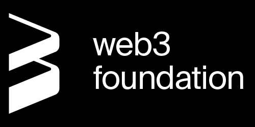

<div align="center">
<a href="https://www.webb.tools/">
    


  </a>
</div>

# Webb Relayer

[](https://github.com/webb-tools/relayer/releases/latest) [](https://github.com/webb-tools/relayer/actions) [](https://opensource.org/licenses/Apache-2.0) [](https://twitter.com/webbprotocol) [](https://t.me/webbprotocol) [](https://discord.gg/cv8EfJu3Tn)

<!-- TABLE OF CONTENTS -->
<h2 id="table-of-contents" style=border:0!important> 📖 Table of Contents</h2>

<details open="open">
  <summary>Table of Contents</summary>
  <ul>
    <li><a href="#start"> Getting Started</a></li>
    <li><a href="#relayer">How to Run Relayer</a></li>
    <li><a href="#docker">Docker setup</a></li>
    <li><a href="#api">Relayer APIs</a></li>
  </ul>  
</details>

<h2 id="start"> Getting Started  🎉 </h2>

In the Webb Protocol, the relayer plays a variety of roles. This repo contains code for an Anchor System oracle, transaction and data relayer, and protocol governance participant. The aim is that these can all be run exclusive to one another to ensure maximum flexibility of external participants to the Webb Protocol.

The relayer system is composed of three main components. Each of these components should be thought of as entirely separate because they could be handled by different entities entirely.

1. Private transaction relaying (of user bridge transactions like Tornado Cash’s relayer)
2. Data querying (for zero-knowledge proof generation)
3. Event listening, proposing, and signature relaying (of DKG proposals where the relayer acts like an oracle)

#### Transaction relaying role

Relayers who fulfill the role of a transaction relayer are responsible with exposing an API for clients who wish to relay their zero-knowledge transactions through and with submitting them. Relayers of this role must possess enough balance on the blockchains in which they will relay these transactions, since, after all, they must possess the native balance to pay the fees for these transactions. Relayers can be configured for any number of chains and protocols from mixers to variable anchors and run for individual chains or all of them that exist for a given bridged set of anchors.

#### Data querying role

Relayers who fulfill this role do so in conjunction with the transaction relaying role although it is not required to possess both. Namely, this role is concerned with listening to the events occurring within an Anchor Protocol instance and storing the data for clients who wish to quickly access it through traditional HTTP methods. This role is actively maintained and sees regular updates to how we hope to store and serve data in the future.

#### Oracle role

Relayers who fulfill the role of an oracle listen to the Anchor Protocol instances on the various chains the anchors exist on. When they hear of insertions into the anchors' merkle trees they handle them accordingly (as is implemented in the event watchers). Those playing this role then relay the anchor update information to other connected Anchors, the DKG governance system, and any other integration that gets implemented in this repo. Oracle relayers help keep the state of an Anchor Protocol instance up to date by ensuring that all anchors within an instance know about the latest state of their neighboring anchors.

For additional information, please refer to the [Webb Relayer Rust Docs](https://webb-tools.github.io/relayer/) 📝. Have feedback on how to improve the relayer network? Or have a specific question to ask? Checkout the [Relayer Feedback Discussion](https://github.com/webb-tools/feedback/discussions/categories/webb-relayer-feedback) 💬.

---

### Prerequisites

This repo uses Rust so it is required to have a Rust developer environment set up. First install and configure rustup:

```bash
# Install
curl --proto '=https' --tlsv1.2 -sSf https://sh.rustup.rs | sh
# Configure
source ~/.cargo/env
```

Configure the Rust toolchain to default to the latest stable version:

```bash
rustup default stable
rustup update
```

Great! Now your Rust environment is ready! 🚀🚀

Lastly, install

- [DVC](https://dvc.org/) is used for fetching large ZK files and managing them alongside git
- [substrate.io](https://docs.substrate.io/main-docs/install/) may require additional dependencies

🚀🚀 Your environment is complete! 🚀🚀

---

<h2 id="relayer"> How to run a relayer </h2>

##### 1. Relayer setup
Clone relayer 
```bash
git clone https://github.com/webb-tools/relayer.git
cd relayer
cargo build --release --features cli -p webb-relayer
```

##### 2. Relayer Configuration
You need to create configuration files for the relayer. You can find multiple examples [here](./config). Simplest of them is running [evm-blanknet](./config/development/evm-blanknet) configuration which connects to our development environment [Orbit](https://github.com/webb-tools/orbit).

You can either use pre defined configurations or create new config directory.

```
relayer-config // path to dir containing relayer configuration files
```
> **Note**: You could also use the `json` format for the config files if you prefer that!

##### 3. Run Relayer
Once relayer configuration files are created we run relayer using following command

```bash
./target/release/webb-relayer -vvv -c ./relayer-config
```
- Example to run relayer with `evm-blanknet` configuration
```bash
./target/release/webb-relayer -vvv -c ./config/development/evm-blanknet
```
---

<h2 id="docker"> Run Relayer with Docker🐳 </h2>

To deploy the relayer with Docker, copy the `docker` folder to your server. Add an `.env` file as described above and save it into the `config` directory. You also need to adjust the `server_name` (domain) specified in `user_conf.d/relayer.conf`. When you are ready, start the relayer with `docker compose up -d`. You can see the logs with `docker compose logs -f`. It will automatically request a TLS certificate using Let's Encrypt and start operating.

> Note: this uses the latest and pre-released version deployed from `develop` branch, change `:edge` to the [latest stable release version](https://github.com/webb-tools/relayer/pkgs/container/relayer). On the other hand if you always want to use the latest development build, set up a cronjob to execute `docker compose pull && docker compose up -d` regularly in the docker folder.

The Docker setup also includes a preconfigured Grafana installation for monitoring. It is available on `localhost:3000` with login `admin` / `admin`. It includes configuration for Slack alerts, to use it enter a Slack Incoming Webhook URL in `provisioning/alerting/alerting.yaml` where it says `slack-placeholder`.

---

<h2 id="api"> Relayer API Documentation </h2>

Relayer provided API support to query cached leaves, configuration info, metrics.
To refer more about API support kindly checkout readme docs [here](./crates/relayer-handlers/src/README.md)

---

## Contributing

Interested in contributing to the Webb Relayer Network? Thank you so much for your interest! We are always appreciative for contributions from the open-source community!

If you have a contribution in mind, please check out our [Contribution Guide](./.github/CONTRIBUTING.md) for information on how to do so. We are excited for your first contribution!

## License

Licensed under <a href="LICENSE">Apache 2.0 license</a>.

Unless you explicitly state otherwise, any contribution intentionally submitted
for inclusion in this crate by you, as defined in the Apache 2.0 license, shall
be licensed as above, without any additional terms or conditions.

## Supported by

<br />
<p align="center">
 
</p>
